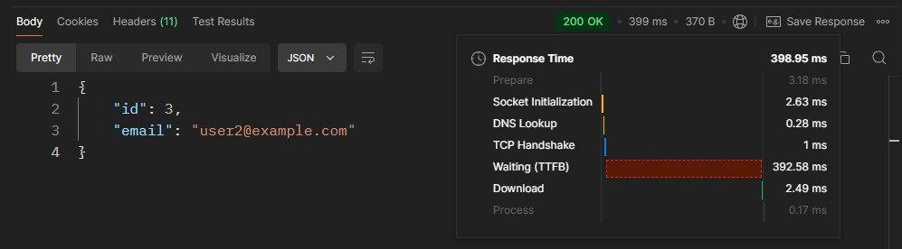
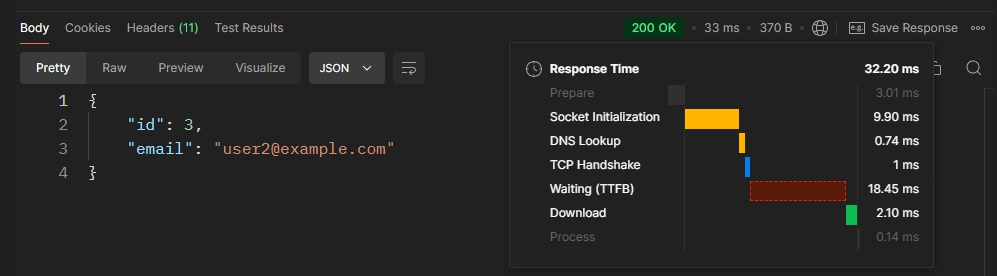
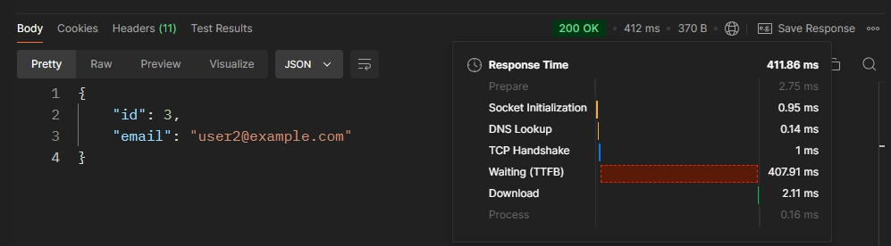
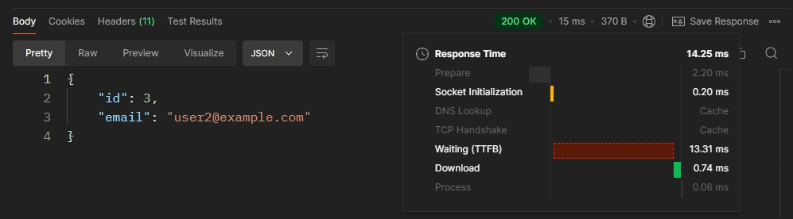

    
    

## 📋 프로젝트 소개
- 이 프로젝트는 레거시 코드 개선과 성능 최적화를 목표로 한 백엔드 시스템 리팩토링 작업입니다. 
- 기존의 복잡한 코드와 성능 저하 문제를 해결하고, 최신 기술을 적용하여 가독성과 유지보수성을 높이는 것을 목적으로 합니다. 
- 주요 작업으로는 JPA 최적화, QueryDSL 도입, Spring Security 적용, 그리고 대용량 데이터 처리 성능 개선 등이 포함되어 있습니다.

## 💡핵심 내용
- JPA 최적화: 레거시 코드에서 발생한 성능 저하를 해결하기 위해 인덱스 적용 및 N+1 문제 해결.
- Spring Security: 인증 및 인가 시스템을 Spring Security로 전환하여 보안 강화.
- 대용량 데이터 처리: 100만 건 이상의 데이터를 효과적으로 주입하고 검색하는 성능 최적화. 
- QueryDSL 도입: 동적 쿼리 처리를 위한 QueryDSL 적용

## 🌱 STACK
### Environment

### Development

 

---

 

## 🔧 코드 개선 
### 1️⃣ LEVEL  1 - 1 @Transactional 에러 해결
- 문제: 할 일 저장 API(/todos)를 호출할 때, Connection is read-only 에러가 발생함.
- 해결: @Transactional 어노테이션의 readOnly = true 설정을 readOnly = false로 변경하여 트랜잭션이 쓰기 작업을 처리할 수 있도록 수정함.

### 2️⃣ LEVEL 1 - 2 JWT에 유저 닉네임 추가
- 문제: User 테이블에 nickname 필드가 없고, JWT에서 닉네임을 추출할 수 없는 상태.
- 해결: User 엔티티에 nickname 컬럼을 추가하고, JWT 토큰 생성 시 닉네임을 포함하도록 수정함.
### 3️⃣ LEVEL 1 - 3 AOP 로직 개선
- 문제: changeUserRole() 메소드가 실행 전 AOP가 동작하지 않음.
- 해결: @Before 어노테이션을 사용하여 메소드 실행 전에 로그가 남도록 AOP 로직을 수정함.
### 4️⃣ LEVEL 1 - 4 컨트롤러 테스트 수정
- 문제: todo_단건_조회_시_todo가_존재하지_않아_예외가_발생한다() 테스트가 실패함.
- 해결: 예외 처리 로직을 추가하고, 테스트 코드에서 예상되는 예외 상황을 반영하여 수정함.
### 5️⃣ LEVEL 1 - 5 JPA 검색 기능 확장
- 문제: weather 조건 및 수정일 기준으로 할 일 검색이 불가능한 상태.
- 해결: JPQL을 사용하여 weather 조건과 수정일 기준으로 검색할 수 있도록 메소드를 수정함.
---
### 6️⃣ LEVEL 2 - 1 JPA Cascade 기능 적용
- 문제: 할 일을 저장할 때, 유저가 담당자로 자동 등록되지 않음.
- 해결: JPA의 cascade 기능을 사용하여 할 일을 저장할 때 유저가 자동으로 담당자로 등록되도록 수정함.
### 7️⃣ LEVEL 2 - 2 N+1 문제 해결
- 문제: CommentController 클래스의 getComments() API에서 N+1 문제가 발생하여 데이터베이스 쿼리 성능이 저하됨.
- 해결: 연관된 엔티티를 한 번에 조회하는 방식으로 변경하여 N+1 문제를 해결함.
### 8️⃣ LEVEL 2 - 3 QueryDSL로 JPQL 변경
- 문제: findByIdWithUser 메소드에서 JPQL을 사용하며 N+1 문제가 발생함.
- 해결: QueryDSL로 변경하여 동적 쿼리를 작성하고 N+1 문제를 해결함.
### 9️⃣ LEVEL 2 - 4 Spring Security 도입
- 문제: 기존의 Filter와 Argument Resolver를 사용한 권한 관리 방식이 복잡함.
- 해결: Spring Security를 도입하여 접근 권한 및 유저 권한 관리를 단순화하고, JWT를 통한 인증 방식은 유지함.
---
### 1️⃣0️⃣ LEVEL 3 - 1 QueryDSL로 일정 검색 기능 구현
- 문제: 일정 검색 기능에서 성능 및 사용성에 문제가 있음.
- 해결: QueryDSL을 활용해 일정 제목, 생성일, 담당자 닉네임으로 검색할 수 있는 기능을 구현하고, Projections를 통해 필요한 필드만 반환하도록 최적화함.
### 1️⃣1️⃣ LEVEL 3 - 2 Transaction 심화 기능
- 문제: 매니저 등록 시 로그 기록이 제대로 처리되지 않음.
- 해결: @Transactional 옵션을 활용해 매니저 등록과 로그 기록이 각각 독립적으로 처리되도록 수정함.
### 1️⃣2️⃣ LEVEL 3 - 3 AWS 활용 (해결중)
- 문제: AWS EC2, RDS, S3를 사용한 배포 및 관리를 설정해야 함.
- 해결: EC2 인스턴스를 활용해 어플리케이션을 실행하고, RDS와 연결하여 데이터베이스를 구축하고, S3를 활용해 유저 프로필 이미지를 관리하는 API를 구현함.
### 1️⃣3️⃣ LEVEL 3 - 4 대용량 데이터 처리
- 문제: 대용량 데이터 처리 성능이 부족함.
- 해결: 테스트 코드로 유저 데이터를 100만 건을 생성하고, 닉네임 검색 속도를 개선하기 위해 여러 방법을 적용해 성능을 향상시킴.

 

---

 

## ⚡ 대용량 데이터 조회
### 성능 테스트 방법
1. 인덱스 미적용 findByNickname (JPA)
2. 인덱스 미적용 findByNickname (JPQL)
3. 인덱스 적용 findByNickname (JPA)
4. 인덱스 적용 findByNickname (JPQL)

### 성능 개선 테스트 결과

| Test Type      | Response Time (ms) |
|----------------|--------------------|
| 인덱스 미적용 (JPA)  | 398.95             |
| 인덱스 적용 (JPA)   | 32.20              |
| 인덱스 미적용 (JPQL) | 411.88             |
| 인덱스 적용 (JPQL)  | 14.25              |

### 인덱스 미적용 (JPA)

 
### 인덱스 적용 (JPA)

 
### 인덱스 미적용 (JPQL)

 
### 인덱스 적용 (JPQL)

 

---

 

## 🚀 트러블 슈팅 
### 1. QueryDSL QClass 생성 오류 해결
### 발생 문제
- QueryDSL 사용 중 javax.persistence.Entity 클래스 로드 오류 발생 및 QClass 파일 생성 실패.

### 해결
- Jakarta 라이브러리로 변경, 어노테이션 프로세싱 활성화, 빌드 도구를 IntelliJ로 전환하여 문제 해결. 또한, Gradle 설정에서 QClass 파일이 정상적으로 생성되도록 경로를 지정함.

- 자세한 내용은 [블로그 링크](https://fargoewave.tistory.com/162)를 참고하세요.
---
### 2. 대용량 데이터 생성 개선
### 발생 문제 
- 대용량 데이터(100만 건) 주입 시 성능 저하 및 IntelliJ의 시스템 지연 발생.
- 배치 주입 과정에서 초기 50만 건 이후 성능이 급격히 떨어졌으며, 삽입 속도가 느려지고 IDE가 응답하지 않음.

### 해결 
- 대량 데이터 주입을 위해 JdbcTemplate을 사용하였고, 성능을 최적화하기 위해 템플릿의 batchUpdate() 메소드를 사용하여 배치 작업을 처리.
- 대량의 데이터를 한번에 처리하지 않고, 배치 단위를 적절히 조정하여 메모리 사용량을 줄이고 성능을 개선.
- 닉네임 중복을 피하기 위해 무작위로 생성된 닉네임 뒤에 고유 번호를 추가하는 방식으로 로직을 최적화하여 닉네임 중복을 방지하고 데이터 주입 성능을 향상.
- 자세한 내용은 [블로그 링크](https://fargoewave.tistory.com/169)를 참고하세요.

 
